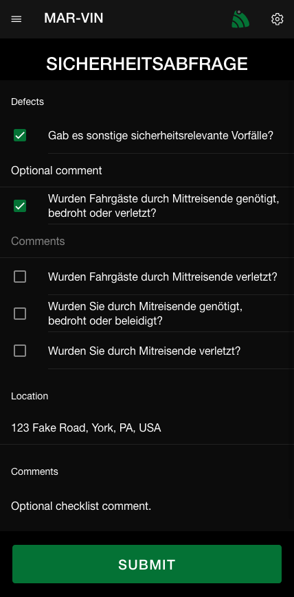

# Checklists

Checklists provide the ability for users to report to the management team a list of issues
with comments and location.

## Features
* Allow location and comments fields to be displayed using `DVIRFieldLocation` and 
`DVIRFieldComments` groups.
* Customize checklist display location using `DVIRTrigger*` groups.
  - For example display a button with the checklist name under the `Trip Summary` screen
  using the `DVIRTriggerTripSummary` group.
* Customize checklist destinations.
  > Destinations are where the user submitted results go.
  - For example send a Geotab text message to a user with the id `b75` using a group named 
  `id:b75` under the group `DVIRDestinationText`.
  > For details on how to obtain a user's id please contact fairfleet.

## Text Message
Text messages are sent to a specific user using Geotab's API.  

### Type definition
The message content will contain a JSON encoded payload matching the following typescript 
type definition.
```typescript
/**
 * Contains the completed checklist result.
 */
interface ChecklistResult {
  /**
   * The checklist id.
   */
  id: string;

  /**
   * The checklist name displayed to the user.
   */
  name: string;

  /**
   * The list of items in the checklist that the user indicated was faulty.
   */
  defects: Defect[];

  /**
   * The user supplied location.
   * 
   * @remarks If checklist was configured with `DVIRFieldLocation` value cannot be undefined.
   * @remarks If present length will be required to be greater than zero.
   * @remarks Additional validation is *NOT* performed on this field. 
   */
  location?: string;

  /**
   * The user supplied comments.
   * 
   * @remarks If checklist was configured with `DVIRFieldComments` value cannot be undefined.
   * @remarks If present value will not be null (however, if empty will be empty string).
   * @remarks Additional validation is *NOT* performed on this field. 
   */
  comments?: string;
}

/**
 * Contains defect information.
 */
type Defect = DefectGroup | DefectItem;

/**
 * Contains a collection of defects.
 */
interface DefectGroup {
  /**
   * The defect group id.
   */
  id: string;

  /**
   * The defect name displayed to the user.
   */
  name: string;

  /**
   * The user defined defects.
   */
  defects: DefectItem[];
}

/**
 * Contains a defect item.
 */
interface DefectItem {
  /**
   * The defect item id.
   */
  id: string;

  /**
   * The defect name.
   */
  name: string;

  /**
   * The user supplied comments.
   */
  comments: string;
}
```
> `id` fields are unique to the customer meaning that the id can be used as a lookup for 
multiple results for a single checklist provided checklists.  These values are supplied by
Geotab, provided the mechanism to edit checklists do not update these IDs they should 
persist through modifications although this has not been tested.

### Example
An example of what the user would see paired with what the text message would contain can
be seen below.

> The checklist before submitting in EcoApp.


> The Geotab `TextMessage` entity response.
```json
{
  "activeFrom": "2021-08-29T22:54:19.190Z",
  "activeTo": "2050-01-01T00:00:00.000Z",
  "isDirectionToVehicle": false,
  "messageContent": {
    "message": "{\"id\":\"b2942\",\"name\":\"SICHERHEITSABFRAGE\",\"defects\":[{\"id\":\"b2947\",\"name\":\"Gab es sonstige sicherheitsrelevante Vorfälle?\",\"comments\":\"Optional comment\"},{\"id\":\"b2944\",\"name\":\"Wurden Fahrgäste durch Mittreisende genötigt, bedroht oder verletzt?\",\"comments\":\"\"}],\"comments\":\"Optional checklist comment.\",\"location\":\"123 Fake Road, York, PA, USA\"}",
    "contentType": "Normal"
  },
  "sent": "2021-08-29T22:54:19.190Z",
  "user": {
    "id": "b5C"
  },
  "device": "NoDeviceId",
  "recipient": {
    "id": "b75"
  },
  "id": "b631D"
}
```

> The `ChecklistResult` extracted from `messageContent.message` field in the `TextMessage`
entity.
```json
{
  "id": "b2942",
  "name": "SICHERHEITSABFRAGE",
  "defects": [
    {
      "id": "b2947",
      "name": "Gab es sonstige sicherheitsrelevante Vorfälle?",
      "comments": "Optional comment"
    },
    {
      "id": "b2944",
      "name": "Wurden Fahrgäste durch Mittreisende genötigt, bedroht oder verletzt?",
      "comments": ""
    }
  ],
  "comments": "Optional checklist comment.",
  "location": "123 Fake Road, York, PA, USA"
}
```